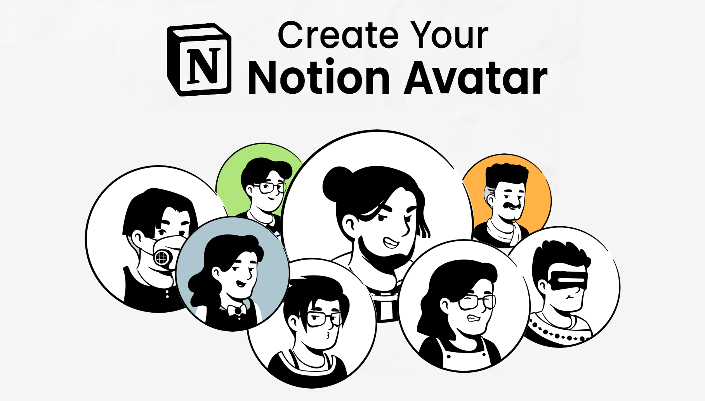

# Notion-Style Avatar Creator

<div align="center">
  
</div>

A fun, customizable avatar generator inspired by Notion's minimalist aesthetic. Create your personal profile picture with a variety of face shapes, hairstyles, eyes, mouths, accessories, outfits, and backgrounds.

## Live Demo

Check out the live demo: [Notion Avatar Generator](https://hmarzban.github.io/notion-avatar-generator/)

## Features

- 🧑 Face options - Choose from different face shapes
- 💇 Hair styles - Select from various hairstyles
- 👁️ Eyes - Customize the look with different eye styles
- 👄 Mouth - Add personality with various mouth expressions
- 👓 Accessories - Enhance your avatar with glasses, earrings, and more
- 👕 Outfits - Dress your avatar with different clothing options
- 🎨 Backgrounds - Set solid colors or add background elements
- 💾 Export as PNG or SVG - Download your creation in your preferred format
- 🌗 Dark/Light mode - Switch between themes for comfortable editing
- 🔄 Randomize - Generate random avatars with one click
- 📱 PWA Support - Install as a standalone app on your device
- 🔌 Complete Offline Support - Create avatars even without an internet connection with automatic asset caching

## Getting Started

## Requirements

This project requires [Bun](https://bun.sh) as the package manager.

```bash
# Install Bun if you don't have it yet
curl -fsSL https://bun.sh/install | bash

# Install dependencies
bun install

# Start development server
bun dev

# Build for production
bun run build
```

This project uses Bun exclusively and is not compatible with npm or yarn.

## Development

- `bun dev` - Start development server
- `bun run build` - Build for production
- `bun run lint` - Run linter
- `bun run preview` - Preview production build locally

Visit `http://localhost:3000` in your browser to start creating your avatar.

## Deployment

The project is automatically deployed to GitHub Pages when changes are pushed to the main branch. The deployment workflow is managed through GitHub Actions.

To deploy manually:

```bash
# Build the project
bun run build

# Preview the build locally
bun run preview
```

## PWA Features

This app supports Progressive Web App (PWA) functionality, which means you can:

- Install it on your home screen on mobile devices
- Use it offline without an internet connection
- Get automatic updates when new versions are available

### Enhanced Offline Support

The app intelligently caches all avatar assets for offline use, providing a complete experience even without internet connection:

- **Automatic Asset Caching**: When you first install the PWA, all avatar elements are automatically cached
- **Smart Caching Strategy**: Assets are cached using an efficient strategy that preserves storage space
- **Network Status Indicators**: Clear UI indicators show when you're offline
- **Manual Cache Control**: Options to manually refresh the cache when online
- **Persistent Usage**: Create and download avatars even when completely offline

### Easy Installation

Installing the app is simple:

1. Look for the "Install for Offline Use" button that appears at the bottom right of the app
2. Click the button and follow the browser's installation prompts
3. The app will be installed on your device and available even when offline
4. On iOS devices, use Safari's "Add to Home Screen" option from the share menu

Once installed, the app will run like a native application with these benefits:

- Fast loading times
- No internet connection required
- All avatar assets available offline
- Full functionality without a browser

## Built With

- React
- TypeScript
- Vite
- Tailwind CSS
- Shadcn UI components
- Vite PWA Plugin
- Workbox (for advanced PWA caching)

## Credits

Special thanks to [DrawKit](https://www.drawkit.com/illustrations/notion-style-avatar-creator) for the amazing illustrations. Checkout the [Figma](https://www.figma.com/community/file/1159777445438667306) for more details.  

## License

This project is open-source and available under the MIT License.

## Contributing

Contributions are welcome! Feel free to open issues or submit pull requests.
