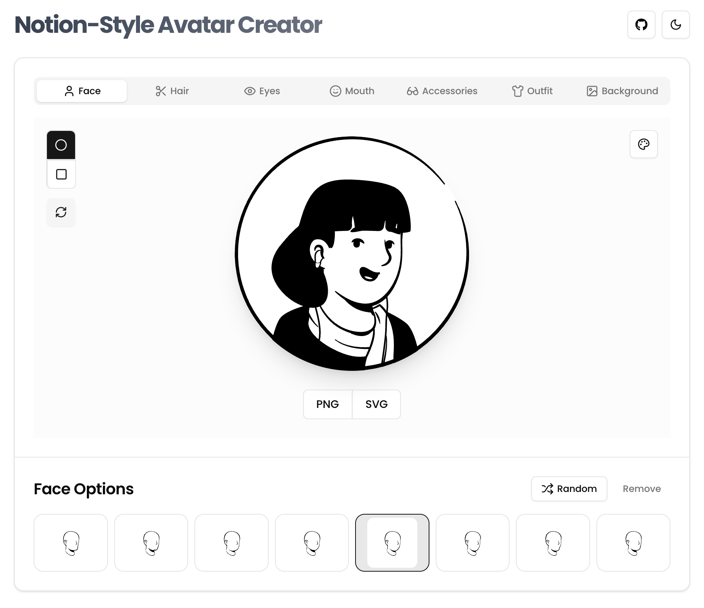

# Notion-Style Avatar Creator

<div align="center">
  
</div>

A fun, customizable avatar generator inspired by Notion's minimalist aesthetic. Create your personal profile picture with a variety of face shapes, hairstyles, eyes, mouths, accessories, outfits, and backgrounds.

## Live Demo

Check out the live demo: [Notion Avatar Generator](https://hmarzban.github.io/notion-avatar-generator/)

## Features

- 🧑 Face options - Choose from different face shapes
- 💇 Hair styles - Select from various hairstyles
- 👁️ Eyes - Customize the look with different eye styles
- 👄 Mouth - Add personality with various mouth expressions
- 👓 Accessories - Enhance your avatar with glasses, earrings, and more
- 👕 Outfits - Dress your avatar with different clothing options
- 🎨 Backgrounds - Set solid colors or add background elements
- 💾 Export as PNG or SVG - Download your creation in your preferred format
- 🌗 Dark/Light mode - Switch between themes for comfortable editing
- 🔄 Randomize - Generate random avatars with one click

## Getting Started

```bash
# Clone the repository
git clone https://github.com/HMarzban/notion-avatar-generator.git

# Navigate to project directory
cd notion-avatar-generator

# Install dependencies
npm install
# or with bun
bun install

# Start the development server
npm run dev
# or with bun
bun run dev
```

Visit `http://localhost:3000` in your browser to start creating your avatar.

## Deployment

The project is automatically deployed to GitHub Pages when changes are pushed to the main branch. The deployment workflow is managed through GitHub Actions.

To deploy manually:

```bash
# Build the project
npm run build

# Preview the build locally
npm run preview
```

## Built With

- React
- TypeScript
- Vite
- Tailwind CSS
- Shadcn UI components
- html-to-image (for exporting avatars)

## Avatar Elements

The project includes several categories of avatar components:

- **Face**: Base face shapes and structures
- **Hair**: Various hairstyles and colors
- **Eyes**: Different eye styles and expressions
- **Mouth**: Various mouth and lip shapes
- **Accessories**: Glasses, earrings, and other add-ons
- **Outfit**: Clothing options for your avatar
- **Background**: Solid colors and background elements

## Credits

Assets based on [Notion Avatar Creator](https://www.figma.com/community/file/1159777445438667306) by DrawKit.

Special thanks to [DrawKit](https://www.drawkit.com/illustrations/notion-style-avatar-creator) for the amazing illustrations.

## License

This project is open-source and available under the MIT License.

## Contributing

Contributions are welcome! Feel free to open issues or submit pull requests.
