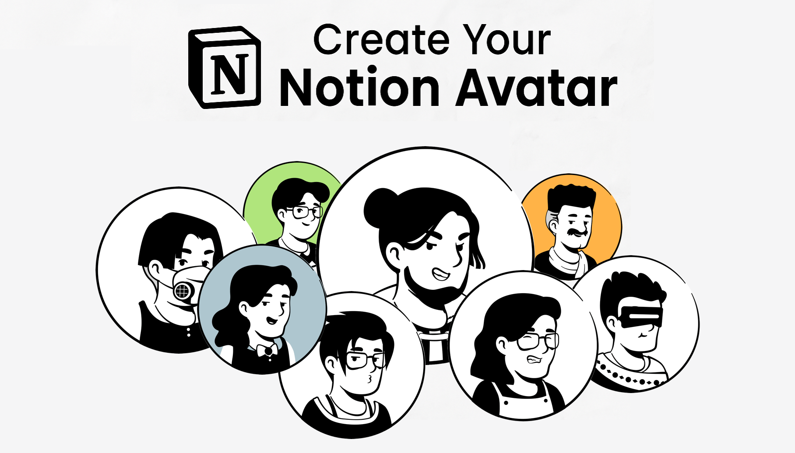

# Notion-Style Avatar Creator

<div align="center">
  
</div>

A fun, customizable avatar generator inspired by Notion's minimalist aesthetic. Create your personal profile picture with a variety of face shapes, hairstyles, eyes, mouths, accessories, outfits, and backgrounds.

## Live Demo

Check out the live demo: [Notion Avatar Generator](https://hmarzban.github.io/notion-avatar-generator/)

## Features

- 🧑 Face options - Choose from different face shapes
- 💇 Hair styles - Select from various hairstyles
- 👁️ Eyes - Customize the look with different eye styles
- 👄 Mouth - Add personality with various mouth expressions
- 👓 Accessories - Enhance your avatar with glasses, earrings, and more
- 👕 Outfits - Dress your avatar with different clothing options
- 🎨 Backgrounds - Set solid colors or add background elements
- 💾 Export a 1024 × 1024 PNG, or an SVG file with an embedded PNG image (not editable vector parts)
- 🌗 Dark/Light mode - Switch between themes for comfortable editing
- 🔄 Randomize - Generate random avatars with one click
- 📱 PWA Support - Install as a standalone app on your device
- 🔌 Offline use after the app and its assets have been cached during an online visit

## Export formats

PNG exports are 1024 × 1024 pixels, with the selected background and circle/square shape. Transparent exports omit the preview checkerboard. SVG export wraps a rendered PNG in an SVG document with a 1024 × 1024 viewBox; individual avatar parts are not editable vector paths, and enlarging the image can reveal pixels. Choose PNG for ordinary profile pictures. Genuine vector composition would require a different export pipeline.

## Engineering decisions and limits

React context owns the selected avatar parts, background, and shape. The preview composes local DrawKit SVG assets as image layers; `html-to-image` captures that composition and the export helpers apply the output shape. Export runs in the browser without an upload server. It reuses stable asset URLs so cached images remain available offline, and removes temporary export elements even when rendering fails. Selections are held in memory, so reloading starts a new avatar.

The browser tests in `tests/avatar.spec.ts` exercise category selection, removal, image dimensions, transparent/circular backgrounds, SVG content, and offline reload after service-worker activation. They run in Chromium; Safari and Firefox export/PWA behavior is not covered by this suite.

## Getting Started

## Requirements

This project uses [Bun](https://bun.sh) as the package manager. Node.js 20+ is needed by the Playwright browser test runner; CI uses Node 22.

```bash
# Install Bun if you don't have it yet
curl -fsSL https://bun.sh/install | bash

# Install dependencies
bun install

# Start development server
bun dev

# Build for production
bun run build
```

This project uses Bun exclusively and is not compatible with npm or yarn.

## Development

- `bun dev` - Start development server
- `bun run build` - Build for production
- `bun run lint` - Run linter
- `bun run test` - Run Chromium browser tests (first run: `bunx playwright install chromium`)
- `bun run preview` - Preview production build locally

Visit `http://localhost:3000` in your browser to start creating your avatar.

## Deployment

The project is automatically deployed to GitHub Pages when changes are pushed to the main branch. The deployment workflow is managed through GitHub Actions.

To deploy manually:

```bash
# Build the project
bun run build

# Preview the build locally
bun run preview
```

## PWA Features

This app supports Progressive Web App (PWA) functionality, which means you can:

- Install it on your home screen on mobile devices
- Use it offline without an internet connection
- Get automatic updates when new versions are available

### Enhanced Offline Support

Offline use needs a successful online first visit and completed asset caching. Browser storage eviction or clearing site data removes that cache; installing the app alone does not guarantee every asset is ready. The app provides:

- **Automatic Asset Caching**: The service worker and asset cache populate while online
- **Smart Caching Strategy**: Assets are cached using an efficient strategy that preserves storage space
- **Network Status Indicators**: Clear UI indicators show when you're offline
- **Manual Cache Control**: Options to manually refresh the cache when online
- **Persistent Usage**: Create and download avatars even when completely offline

### Easy Installation

Installing the app is simple:

1. Look for the "Install for Offline Use" button that appears at the bottom right of the app
2. Click the button and follow the browser's installation prompts
3. The app will be installed on your device and available even when offline
4. On iOS devices, use Safari's "Add to Home Screen" option from the share menu

Once installed, the app will run like a native application with these benefits:

- Fast loading times
- Offline use of successfully cached app files and avatar assets
- Full functionality without a browser

## Built With

- React
- TypeScript
- Vite
- Tailwind CSS
- Shadcn UI components
- Vite PWA Plugin
- Workbox (for advanced PWA caching)

## Credits

Special thanks to [DrawKit](https://www.drawkit.com/illustrations/notion-style-avatar-creator) for the amazing illustrations. Checkout the [Figma](https://www.figma.com/community/file/1159777445438667306) for more details.  

## License

This project is open-source and available under the MIT License.

## Contributing

Contributions are welcome! Feel free to open issues or submit pull requests.
